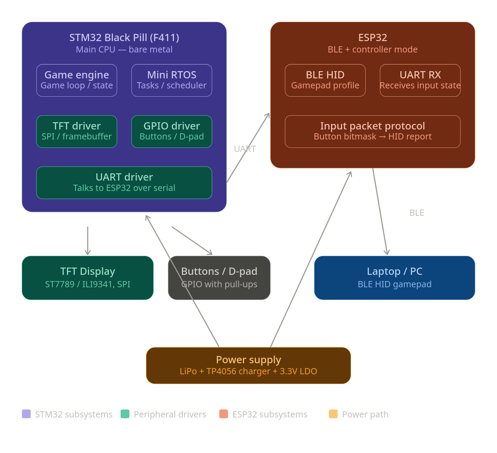
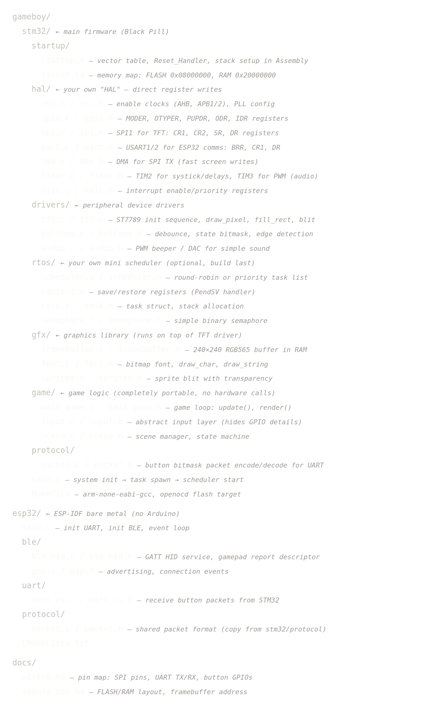
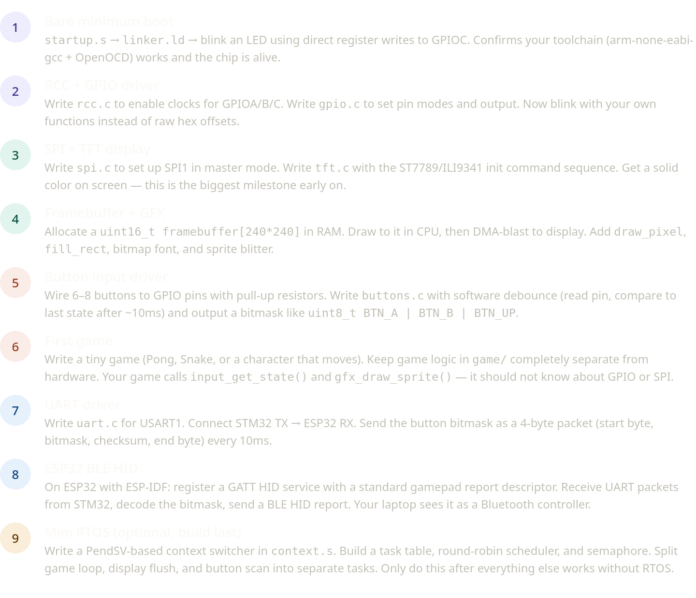

Here's everything you need to understand to actually build this:

**Toolchain setup**

You need `arm-none-eabi-gcc` (the compiler), `arm-none-eabi-binutils` (for objcopy to make .bin files), and `openocd` (to flash over ST-Link). Your Makefile will look like:
```makefile
CC = arm-none-eabi-gcc
CFLAGS = -mcpu=cortex-m4 -mthumb -mfpu=fpv4-sp-d16 -mfloat-abi=hard -O2 -nostdlib
LDFLAGS = -T linker.ld -nostdlib
```
The `-nostdlib` flag is what makes it truly bare-metal — no libc, no startup from vendor.

**The startup file is everything**

`startup.s` must define the vector table (a table of function pointers at address 0x08000000), set the stack pointer, call `SystemInit` to configure clocks, then call `main`. You also need to copy `.data` from FLASH to RAM and zero out `.bss` here. This is the first file you write and the hardest to debug.

**Register-level drivers**

Every peripheral is controlled by reading/writing memory-mapped registers. You define base addresses yourself:
```c
#define RCC_BASE   0x40023800
#define GPIOA_BASE 0x40020000
#define SPI1_BASE  0x40013000
// etc. — from the STM32F411 reference manual (RM0383)
```
Your entire `gpio.c` is just functions that compute the correct bit shifts and write to `GPIOA->MODER`, `ODR`, etc. The STM32F411 Reference Manual (free PDF from ST) is your bible — every register, every bit.

**The UART packet protocol between STM32 and ESP32**

Keep it dead simple: `[0xAA] [bitmask_lo] [bitmask_hi] [checksum]` — 4 bytes, sent every 10ms. On the ESP32 side, scan incoming bytes for the 0xAA start byte, buffer 4 bytes, validate checksum, then convert to a BLE HID gamepad report.

**BLE HID on ESP32**

ESP-IDF has `esp_bt_hid_device` APIs but they're high-level. For bare-metal style, you write a GATT server with the standard HID service UUID (0x1812), input report characteristic (0x2A4D), and a report descriptor that describes a gamepad (4 axes + 8 buttons). There are standard HID gamepad descriptor templates you can adapt from the USB HID spec.

**The framebuffer trick**

Don't write pixels one by one over SPI — it's too slow. Instead, maintain a `uint16_t fb[240*240]` array in RAM (~115 KB — fits in STM32F411's 128 KB RAM). Your game code writes to this buffer freely. Then once per frame, you kick off a DMA transfer from RAM → SPI1 → display. The CPU is free while DMA runs. This is how real game engines work.

**Key references to bookmark:**
- STM32F411 Reference Manual RM0383 — st.com (free)
- ILI9341 or ST7789 datasheet for your TFT
- USB HID Usage Tables spec (for the gamepad HID descriptor)
- ESP-IDF Programming Guide — espressif.com

Start with Phase 1 and get that LED blinking from scratch. Once you see it blink with your own startup assembly and your own register write, the rest follows the same pattern. Want me to write the actual code for any specific phase — like the `startup.s`, the `spi.c`, or the TFT init sequence?